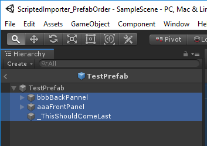
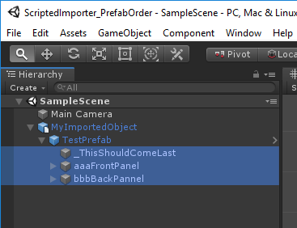

# ScriptedImporter_PrefabOrder
 Prefab Order Bug with Unity Scripted Importers
 -----------------------
 This project contains a simple Scripted Importer ([`MyScriptedImporter.cs`](ScriptedImporter_PrefabOrder/Assets/MyScriptedImporter.cs
)) with these two game objects:

1. An empty main game object (this is the parent)
2. An instantiated prefab object (this is the child)

The referenced prefab, [`TestPrefab`](ScriptedImporter_PrefabOrder/Assets/TestPrefab.prefab), itself has 3 child objects with the following order:

1. `bbbBackPanel`
2. `aaaFrontPanel`
3. `_ThisShouldComeLast`

 
We would like this order of child objects to be preserved when we instantiate the `TestPrefab` and attach it to the main object through our scripted importer. However, the child objects are ordered alphabetically.

1. `_ThisShouldComeLast`
2. `aaaFrontPanel`
3. `bbbBackPanel`

Some Unity components, like UI elements, are rendered in the order they appear in the scene hierarchy so the re-ordered children can be the source of bugs.

This depot is currently using Unity 2019.2.8f1. This behavior was first noticed with 2018.3.0f2.